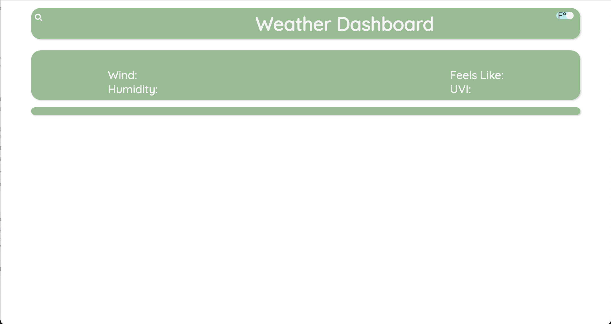
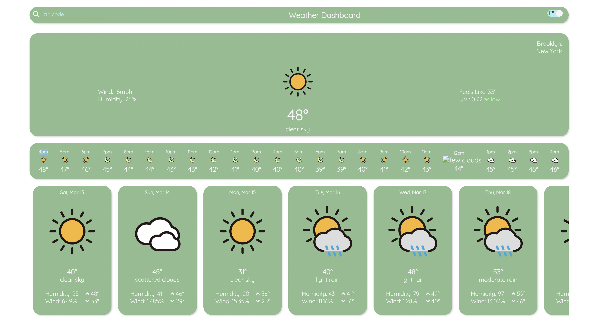

# Weather-Dashboard
An app to retrieve weather data for zip codes.

## About

This application uses a third-party API to retrieve data about the weather based on user input. Besides being a simple yet useful application, it demonstrates the power of using third-party API's to retrieve a vast array of different information available across the web.

## Application

https://neilcreveling.github.io/Weather-Dashboard/

Upon opening the link, the user is presented with an empty weather dashboard. In the top left corner there is a search input area to type a zip code, and in the top right corner the user may toggle fahrenheit or celsius temperature measurement.

When the zip code is entered, the dashboard updates with a variety of information. Information output includes today's weather, hourly weather, and weather for days into the future. Weather features include temperature, humidity, wind speed, uv index, and general weather condition, indicated in text and icon format.

## License

MIT License

Copyright (c) 2021 Neil Creveling

Permission is hereby granted, free of charge, to any person obtaining a copy of this software and associated documentation files (the "Software"), to deal in the Software without restriction, including without limitation the rights to use, copy, modify, merge, publish, distribute, sublicense, and/or sell copies of the Software, and to permit persons to whom the Software is furnished to do so, subject to the following conditions:

The above copyright notice and this permission notice shall be included in all copies or substantial portions of the Software.

THE SOFTWARE IS PROVIDED "AS IS", WITHOUT WARRANTY OF ANY KIND, EXPRESS OR IMPLIED, INCLUDING BUT NOT LIMITED TO THE WARRANTIES OF MERCHANTABILITY, FITNESS FOR A PARTICULAR PURPOSE AND NONINFRINGEMENT. IN NO EVENT SHALL THE AUTHORS OR COPYRIGHT HOLDERS BE LIABLE FOR ANY CLAIM, DAMAGES OR OTHER LIABILITY, WHETHER IN AN ACTION OF CONTRACT, TORT OR OTHERWISE, ARISING FROM, OUT OF OR IN CONNECTION WITH THE SOFTWARE OR THE USE OR OTHER DEALINGS IN THE SOFTWARE.
